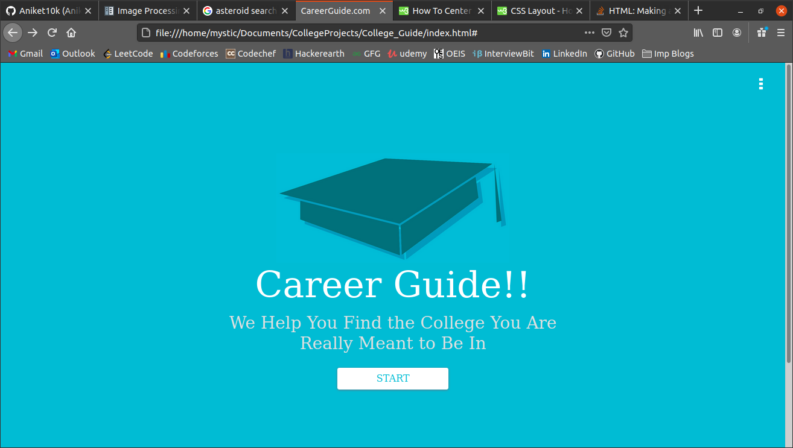
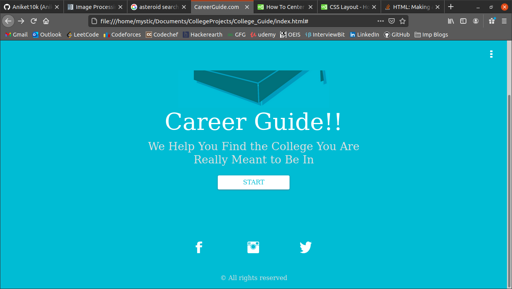
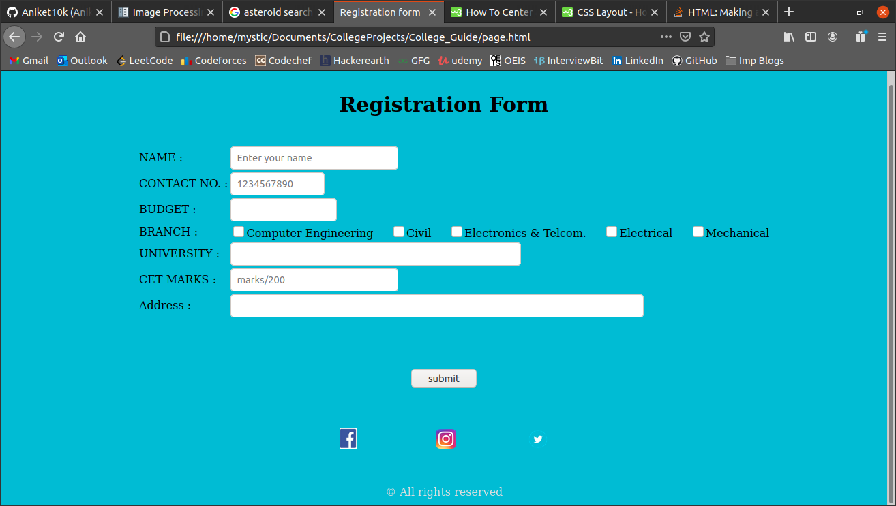
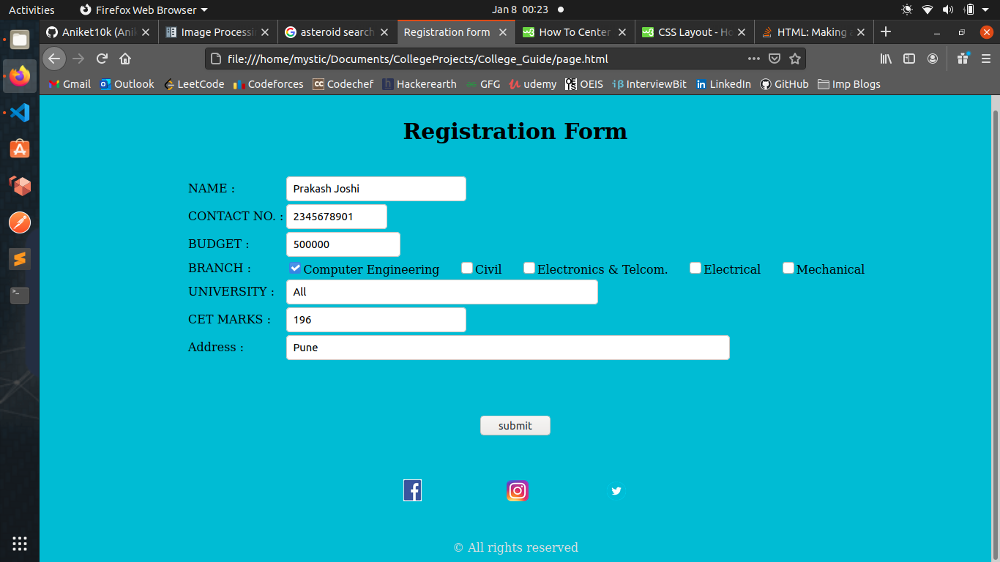
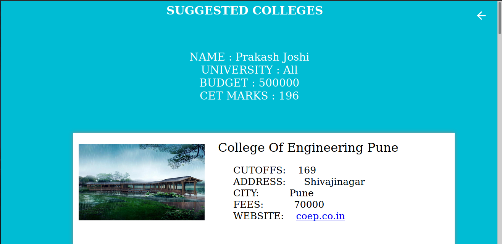
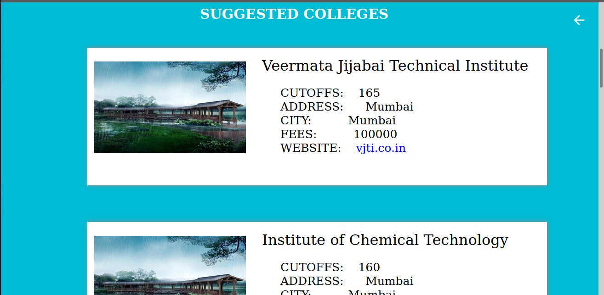
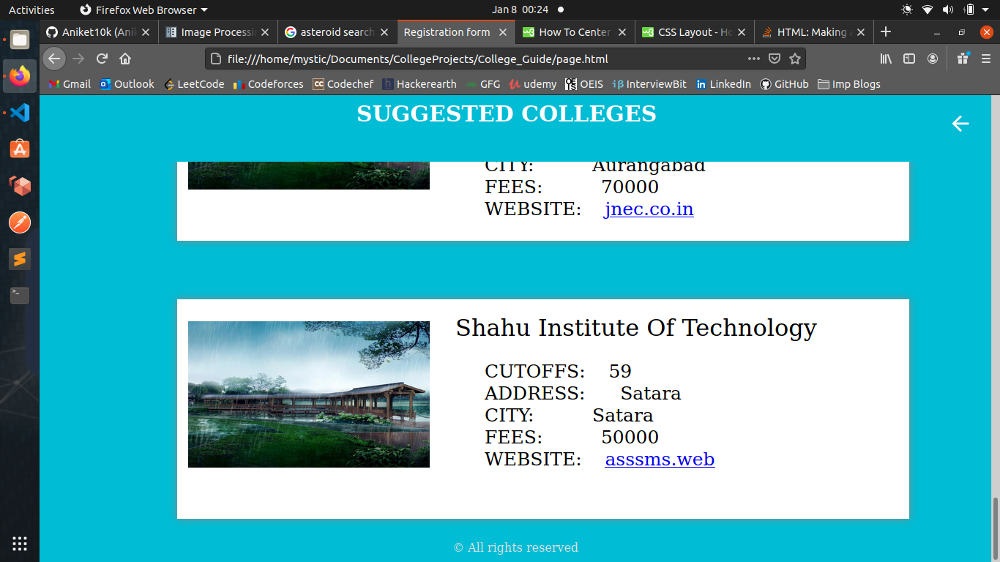

# College Guide
A college finder web application for students which suggests the best college based on their marks in CET and budget as per fees of corresponding college.

Technologies : HTML, CSS, Javascript

Home

Registration form

Results

College project for Web development course!!
